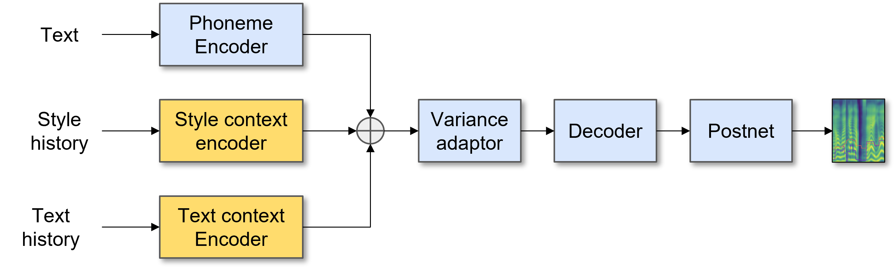

# Converstaional continuity in TTS

This project implements a model for conversationally continuous text-to-speech (TTS).

The model takes as input the text for current utterance, as well as the style and text content information of previous utterances in the conversation.

 By incorporating both style and text content from previous utterances, the model aims to produce audio in a desired style that seamlessly fits within the ongoing conversation.

The model is trained on a [DailyTalk](https://arxiv.org/abs/2207.01063), a conversational dataset. The conversation is dyadic between one male and one female speaker. It's a recording of 2,541 dialogues.

The results show that the model is able to generate audio clips that are natural-sounding, accurate, and consistent with the style of the previous utterances.


## Model



Text encoder converts the current input phonemes to phoneme embeddings

A pretrained [Global Style Tokens](https://arxiv.org/abs/1803.09017) (GST) model is used to get the style embeddings.
Style encoder is an adaptation of GST model for FastSpeech2 architecture. While training, the mel spectrogram of same audio is given as style token, and the GST module learns to extract style of a speech. During inference, the style is extracted given the mel-spectrogram of any audio.

For the first dialog, no style is added during training, you may add a style at inference if desired. For later dialogs, style embeddings of previous dialogs is input to the style context encoder.

BERT embeddings of previous utterance’s texts are also used to capture context from text. i.e. the text context encoder is a pretrained BERT model.

These three features - phoneme embeddings of current utterance, style embedding of previous (upto 10) utterances and text embedding for previous (upto 10) utterances are concatenated and passed through a variance adaptor.

Variance adaptor has pitch, energy and duration predictor modules.

This output is then passed through transformer decoder and a postnet module to generate the mel spectrogram of the current utterance.

The process is repeated for the entire conversation

[WavGlow](https://pytorch.org/hub/nvidia_deeplearningexamples_waveglow/) vocoder is used to convert mel spectrograms to audio.


## Datasets

For training GST model for style embedding extraction:
- Blizzard

For training conversational TTS:
- DailyTalk


## Preprocessing
 
First, run 
```
python prepare_align.py config/LJSpeech/preprocess.yaml
```
for some preparations.

[Montreal Forced Aligner](https://montreal-forced-aligner.readthedocs.io/en/latest/) (MFA) is used to obtain the alignments between the utterances and the phoneme sequences.
Save the textgrid files after mfa alignment to ``preprocessed_data/LJSpeech/TextGrid/``.

After that, run the preprocessing script ``pre.sh``


## Training

- To train the GST model, run ``gst_run.sh``.
- Save the GST (style embeddings) of dialogs by running ``get_gstemb.py``.
- Extract and save the BERT embeddings of dialogs using a [pretrained BERT](https://huggingface.co/docs/transformers/model_doc/bert) model.
- To train the conversational TTS, ``run dt_run.sh``.

Do make necessary changes in the config files and .sh files as required, based on paths and datasets used to training.


## Inference

```
python3 synth_dt.py --source preprocessed_data/DailyTalk/val.txt --restore_step 900000 --mode batch -p config/DailyTalk/preprocess.yaml -m config/DailyTalk/model.yaml -t config/DailyTalk/train.yaml
```
to synthesize all utterances in ``preprocessed_data/DailyTalk/val.txt``

# TensorBoard

Use
```
tensorboard --logdir output/log/
```


# Code References

- [FastSpeech2 implimentation by mig024](https://github.com/ming024/FastSpeech2)
- [DailyTalk: Spoken Dialogue Dataset for Conversational Text-to-Speech](https://github.com/keonlee9420/DailyTalk)
- [ESPnet GST](https://github.com/espnet/espnet/tree/master/espnet2/tts)
